  # OpenClaw - Discord Reddit Research Agent

**A 5-layer AI agent architecture that monitors Discord for business forms, performs Reddit research, and returns insights.**

Powered by OpenClaw runtime with Reddit research capabilities via Lob 🦞, your dedicated research assistant.

---

## 📋 Table of Contents

- [Overview](#overview)
- [Architecture](#architecture)
- [Workflows](#workflows)
- [Skills](#skills)
- [Configuration](#configuration)
- [Setup](#setup)
- [Usage](#usage)
- [API Webhooks](#api-webhooks)
- [Troubleshooting](#troubleshooting)

---

## Overview

OpenClaw is an event-driven AI agent that:

1. **Listens** to Discord form submissions in `#filled-answers`
2. **Extracts** structured business data (name, industry, audience, products, USP)
3. **Researches** relevant Reddit communities and trends
4. **Compiles** findings and posts them back to Discord

**Agent Identity:** Lob 🦞 - Reddit research specialist
**Primary Model:** DeepSeek R1 (via OpenRouter)
**Gateway:** OpenClaw runtime (port 18789)

---

## Architecture

OpenClaw implements a **5-layer control plane architecture**:

```
┌─────────────────────────────────────────────────┐
│  Layer 1: Communication Layer                   │
│  Discord API, Webhooks, Message Ingestion       │
└──────────────────┬──────────────────────────────┘
                   │
┌──────────────────▼──────────────────────────────┐
│  Layer 2: Channel Adapter (Reserved)            │
│  Platform normalization (future: Slack, etc.)   │
└──────────────────┬──────────────────────────────┘
                   │
┌──────────────────▼──────────────────────────────┐
│  Layer 3: Gateway (Control Plane)               │
│  Session management, auth, routing (port 18789) │
└──────────────────┬──────────────────────────────┘
                   │
┌──────────────────▼──────────────────────────────┐
│  Layer 4: Pi Engine (Agent Loop)                │
│  Personality (SOUL.md), Rules (AGENTS.md)      │
│  LLM reasoning & decision-making                │
└──────────────────┬──────────────────────────────┘
                   │
┌──────────────────▼──────────────────────────────┐
│  Layer 5: Skill Execution Layer                 │
│  discord-form-reader, form-to-reddit-pipeline   │
│  reddit-readonly (tool invocation)              │
└─────────────────────────────────────────────────┘
```

### Layer Implementations

| Layer | Component | Your Implementation |
|-------|-----------|-------------------|
| 1 | Communication | Discord API (token in `openclaw.json`) |
| 2 | Adapter | Reserved for multi-platform support |
| 3 | Gateway | OpenClaw daemon (port 18789) |
| 4 | Pi Engine | `SOUL.md` + `AGENTS.md` + LLM models |
| 5 | Skills | 3 executable skills in `workspace/skills/` |

---

## Workflows

### Complete End-to-End Workflow

```mermaid
graph TD
    A["🔔 Discord Message Arrives<br/>User submits form in #filled-answers"] --> B["<b>Layer 1: Communication Layer</b><br/>Discord API receives message<br/>Token: openclaw.json"]
    
    B --> C["<b>Layer 3: Gateway</b><br/>OpenClaw Runtime<br/>Port: 18789"]
    
    C --> D["Route Message"]
    D --> E["Create/Load Session<br/>agents/main/sessions/*.jsonl"]
    E --> F["Validate Auth<br/>agents/main/agent/<br/>auth-profiles.json"]
    
    F --> G["<b>Layer 4: Pi Engine</b><br/>Load Agent Context"]
    
    G --> H["Read SOUL.md<br/>Identity: Lob 🦞<br/>Role: Reddit Research Assistant"]
    G --> I["Read AGENTS.md<br/>Rules, Memory, Personality"]
    G --> J["Load LLM Config<br/>openclaw.json<br/>Model: DeepSeek R1"]
    
    H --> K["Analyze Message<br/>Is it a form submission?"]
    I --> K
    J --> K
    
    K --> L{Form Valid?}
    
    L -->|❌ Invalid| M["Send Error<br/>Back to Discord"]
    L -->|✅ Valid| N["<b>Layer 5: Skill Execution</b><br/>Extract Data & Invoke Skills"]
    
    N --> O["1️⃣ discord-form-reader<br/>workspace/skills/<br/>discord-form-reader/<br/><br/>Extract:<br/>- businessName<br/>- industry<br/>- targetAudience<br/>- productsServices<br/>- usp"]
    
    O --> P["Structured Data<br/>{<br/>  businessName: 'Acme Corp',<br/>  industry: 'Tech',<br/>  ...<br/>}"]
    
    P --> Q["2️⃣ form-to-reddit-pipeline<br/>workspace/skills/<br/>form-to-reddit-pipeline/<br/><br/>Orchestrate full flow"]
    
    Q --> R["3️⃣ reddit-readonly<br/>workspace/skills/<br/>reddit-readonly/<br/><br/>Execute Research:<br/>- Search subreddits<br/>- Find relevant posts<br/>- Extract trends<br/>- Identify high-engagement<br/>- Compile insights"]
    
    R --> S["Research Results<br/>{<br/>  subreddits: [...],<br/>  posts: [...],<br/>  trends: [...],<br/>  insights: [...]<br/>}"]
    
    S --> T["Compile Final Report<br/>Format for Discord"]
    
    T --> U["<b>Layer 3: Gateway</b><br/>Send Response"]
    
    U --> V["<b>Layer 1: Communication</b><br/>Discord API<br/>Send to #filled-answers"]
    
    V --> W["✅ User sees research results<br/>in Discord"]
    
    M --> X["Store Error in<br/>agents/main/sessions/"]
    W --> Y["Store Session Complete<br/>agents/main/sessions/"]
    X --> Z["End"]
    Y --> Z
    
    style A fill:#87CEEB
    style B fill:#87CEEB
    style C fill:#4169E1
    style G fill:#9370DB
    style N fill:#FFA500
    style W fill:#90EE90
    style Z fill:#D3D3D3
```



### Heartbeat Polling Workflow

**Triggered every 20 seconds** (configurable in `openclaw.json`):

1. **Check** Discord `#filled-answers` channel for new forms
2. **Detect** unprocessed submissions
3. **Trigger** `form-to-reddit-pipeline` skill
4. **Wait** for completion
5. **Post** results back to Discord
6. **Log** session state to `agents/main/sessions/`

---

## Skills

### 1️⃣ discord-form-reader

**Purpose:** Parse and validate Discord form submissions

**Location:** `workspace/skills/discord-form-reader/`

**What it does:**
- Monitors `#filled-answers` channel
- Extracts structured business data from message content
- Validates required fields

**Input Format:**
```
Business Form Submission:
Name: Acme Corporation
Industry: SaaS
Target Audience: Small businesses
Products/Services: Project management tools
Unique Selling Prop: 10x faster than competitors
```

**Output:**
```json
{
  "ok": true,
  "data": {
    "businessName": "Acme Corporation",
    "industry": "SaaS",
    "targetAudience": "Small businesses",
    "productsServices": "Project management tools",
    "usp": "10x faster than competitors",
    "timestamp": "2026-05-08T10:30:00Z"
  }
}
```

**Files:**
- `SKILL.md` - Skill definition & schema
- `scripts/discord-form-reader.mjs` - Parser implementation
- `_meta.json` - Metadata

---

### 2️⃣ form-to-reddit-pipeline

**Purpose:** Orchestrate the complete form → research → results flow

**Location:** `workspace/skills/form-to-reddit-pipeline/`

**What it does:**
- Accepts parsed form data from discord-form-reader
- Calls reddit-readonly with business context
- Aggregates and formats results
- Returns findings ready for Discord

**Execution Flow:**
```
Input (structured form)
    ↓
Call reddit-readonly with industry + audience
    ↓
Collect subreddit recommendations
    ↓
Fetch top posts & comments
    ↓
Identify trends & high-engagement content
    ↓
Compile research report
    ↓
Output JSON with findings
```

**Files:**
- `SKILL.md` - Orchestration config
- `scripts/form-to-reddit-pipeline.mjs` - Orchestrator logic
- `_meta.json` - Metadata

---

### 3️⃣ reddit-readonly

**Purpose:** Research Reddit communities and extract business insights

**Location:** `workspace/skills/reddit-readonly/`

**What it does:**
- Searches relevant subreddits based on industry/audience
- Fetches high-engagement posts
- Extracts themes, pain points, and opportunities
- Read-only (never posts to Reddit)

**Input:**
```json
{
  "industry": "SaaS",
  "targetAudience": "Small businesses",
  "productsServices": "Project management",
  "limit": 50
}
```

**Output:**
```json
{
  "ok": true,
  "data": {
    "subreddits": [
      {
        "name": "r/smallbusiness",
        "relevance": "high",
        "postCount": 5
      }
    ],
    "topPosts": [
      {
        "subreddit": "r/projectmanagement",
        "title": "Best tools for remote teams",
        "upvotes": 324,
        "permalink": "...",
        "excerpt": "..."
      }
    ],
    "trends": [
      "Remote-first collaboration",
      "AI-powered workflows",
      "Integration capabilities"
    ],
    "recommendations": "..."
  }
}
```

**Reddit Integration:**
- Uses Reddit API (public endpoints)
- Respects rate limits (adds delays between requests)
- Reads public posts/comments only
- User-Agent identification

**Files:**
- `SKILL.md` - Documentation & rules
- `scripts/reddit-readonly.mjs` - Research engine
- `references/OUTPUT_SCHEMA.md` - Data format specs
- `_meta.json` - Metadata

---

## Configuration

### openclaw.json

**Primary Model (Layer 4):**
```json
{
  "agents": {
    "defaults": {
      "model": {
        "primary": "openrouter/auto"
      },
      "models": {
        "huggingface/deepseek-ai/DeepSeek-R1": {},
        "google/gemini-3.1-pro-preview": {},
        "openrouter/auto": { "alias": "OpenRouter" }
      }
    }
  }
}
```

**Discord Integration (Layer 1):**
```json
{
  "channels": {
    "discord": {
      "enabled": true,
      "token": "YOUR_DISCORD_BOT_TOKEN",
      "guilds": {
        "*": { "requireMention": false }
      },
      "allowBots": true
    }
  }
}
```

**Gateway Configuration (Layer 3):**
```json
{
  "gateway": {
    "port": 18789,
    "mode": "local",
    "auth": {
      "mode": "token",
      "token": "your_gateway_token"
    }
  }
}
```

**Heartbeat Configuration:**
```json
{
  "agents": {
    "defaults": {
      "heartbeat": {
        "every": "20s"
      }
    }
  }
}
```

### workspace/SOUL.md

Defines agent personality and core identity:

```markdown
# Reddit Research Agent

**Name:** Lob 🦞
**Role:** Reddit research specialist
**Vibe:** Friendly, thorough, data-driven

## Capabilities
- Search and fetch Reddit posts
- Summarize threads by topic
- Track recurring themes
- Compile structured reports

## Hard Rules
- Read-only research only
- Always cite subreddit & URL
- Flag high-engagement posts (100+ upvotes)
```

### workspace/AGENTS.md

Runtime configuration, memory management, group chat rules, and execution guidelines.

### workspace/HEARTBEAT.md

Periodic tasks executed every 20 seconds:

```markdown
- Check Discord #filled-answers for new forms
- Process them using form-to-reddit-pipeline skill
- Log results to memory
```

---

## Setup

### Prerequisites

- Node.js 18+ (for skill execution)
- OpenClaw runtime installed
- Discord bot token
- Reddit API access (public endpoints)
- LLM API key (Gemini, DeepSeek, or OpenRouter)

### Installation

1. **Initialize OpenClaw:**
   ```bash
   openclaw init
   ```

2. **Configure Discord Token:**
   Edit `~/.openclaw/openclaw.json`:
   ```json
   "channels": {
     "discord": {
       "token": "YOUR_BOT_TOKEN_HERE"
     }
   }
   ```

3. **Set LLM API Keys:**
   ```bash
   openclaw auth:set google:default YOUR_GEMINI_KEY
   # or
   openclaw auth:set huggingface:default YOUR_HUGGINGFACE_KEY
   ```

4. **Start the Gateway:**
   ```bash
   openclaw gateway start
   ```

5. **Verify it's running:**
   ```bash
   curl http://localhost:18789/health
   ```

---

## Usage

### Manual Trigger

Submit a form to Discord `#filled-answers`:

```
Business Form Submission:
Name: TechCorp Solutions
Industry: Enterprise SaaS
Target Audience: Fortune 500 companies
Products/Services: Data analytics platform
Unique Selling Prop: Real-time insights, 99.99% uptime
```

### Automated (Heartbeat)

The agent automatically:
1. Polls Discord every 20 seconds
2. Detects new forms
3. Runs research pipeline
4. Posts results back

### View Session Logs

```bash
cat ~/.openclaw/agents/main/sessions/
```

### View Agent Logs

```bash
openclaw logs --follow
```

---

## API Webhooks

### Gateway Health Check

**Endpoint:** `GET http://localhost:18789/health`

**Response:**
```json
{
  "status": "ok",
  "timestamp": "2026-05-08T10:30:00Z"
}
```

### Submit Message Manually

**Endpoint:** `POST http://localhost:18789/api/message`

**Request:**
```json
{
  "source": "discord",
  "userId": "user123",
  "channelId": "filled-answers",
  "content": "Business Form Submission: Name: Acme Corp, Industry: SaaS, ...",
  "sessionId": "session-123"
}
```

**Response:**
```json
{
  "ok": true,
  "response": "Research complete. Found 5 relevant subreddits with 23 high-engagement posts."
}
```

### Get Session Info

**Endpoint:** `GET http://localhost:18789/api/session/:sessionId`

**Response:**
```json
{
  "ok": true,
  "session": {
    "id": "session-123",
    "userId": "user123",
    "source": "discord",
    "createdAt": "2026-05-08T10:30:00Z",
    "lastActivity": "2026-05-08T10:35:00Z",
    "state": { ... }
  }
}
```

---

## Troubleshooting

### Gateway won't start

```bash
# Check if port 18789 is already in use
lsof -i :18789

# Kill existing process
kill -9 <PID>

# Restart
openclaw gateway start
```

### Discord bot not responding

1. **Verify token in `openclaw.json`:**
   ```bash
   cat ~/.openclaw/openclaw.json | grep "discord" -A 5
   ```

2. **Check bot permissions in Discord server:**
   - Send Messages ✅
   - Read Message History ✅
   - Add Reactions ✅

3. **Check Discord logs:**
   ```bash
   openclaw logs --follow | grep discord
   ```

### Reddit research returning no results

1. **Verify subreddit names:**
   - Check if subreddit exists on Reddit
   - Check for typos

2. **Check rate limits:**
   - Add delays via environment variables
   - Reduce `--limit` parameter

3. **Test manually:**
   ```bash
   node workspace/skills/reddit-readonly/scripts/reddit-readonly.mjs '{
     "industry": "SaaS",
     "targetAudience": "Startups",
     "limit": 10
   }'
   ```

### Session data not persisting

Check `agents/main/sessions/` directory:
```bash
ls -la ~/.openclaw/agents/main/sessions/
```

Verify write permissions:
```bash
chmod 755 ~/.openclaw/agents/main/sessions/
```

---

## File Structure

```
~/.openclaw/
├── openclaw.json              # Main config (Discord token, LLM, gateway)
├── agents/
│   └── main/
│       ├── gateway/           # Gateway server files (future)
│       ├── sessions/          # User session JSONL files
│       └── agent/
│           ├── auth-profiles.json
│           └── models.json
├── workspace/
│   ├── SOUL.md               # Agent personality (Lob 🦞)
│   ├── AGENTS.md             # Execution rules & memory
│   ├── HEARTBEAT.md          # Periodic tasks (every 20s)
│   ├── USER.md               # User info
│   ├── TOOLS.md              # Environment-specific config
│   ├── IDENTITY.md           # Agent identity
│   └── skills/
│       ├── discord-form-reader/
│       │   ├── SKILL.md
│       │   └── scripts/discord-form-reader.mjs
│       ├── form-to-reddit-pipeline/
│       │   ├── SKILL.md
│       │   └── scripts/form-to-reddit-pipeline.mjs
│       └── reddit-readonly/
│           ├── SKILL.md
│           ├── scripts/reddit-readonly.mjs
│           └── references/OUTPUT_SCHEMA.md
├── credentials/
│   └── github-copilot.token.json
└── logs/
    └── config-audit.jsonl
```

---

## Architecture Diagram

The complete workflow from Discord message to research results:

```
┌─────────────────────────────────────────────────────────────────────┐
│                     OpenClaw Complete Workflow                       │
│                                                                       │
│  Discord Message   →  Layer 1 (Communication)  →  Layer 3 (Gateway)│
│  "Form submitted"      Discord API                 OpenClaw daemon  │
│                        Token validation             Session storage │
│                                                                       │
│                    ↓                                                  │
│                Layer 4 (Pi Engine)                                   │
│                SOUL.md (Identity)                                    │
│                AGENTS.md (Rules)                                     │
│                LLM reasoning                                          │
│                                                                       │
│                    ↓                                                  │
│            Layer 5 (Skill Execution)                                 │
│            discord-form-reader        Extract structured data        │
│            form-to-reddit-pipeline    Orchestrate workflow           │
│            reddit-readonly            Research Reddit communities    │
│                                                                       │
│                    ↓                                                  │
│            Layer 3 (Gateway)           Compile results               │
│            Return to Discord                                          │
│                                                                       │
│                    ↓                                                  │
│            Layer 1 (Communication)                                    │
│            Post results to #filled-answers                            │
│            User sees research findings                                │
└─────────────────────────────────────────────────────────────────────┘Skill documentation in `workspace/skills/*/SKILL.md`
